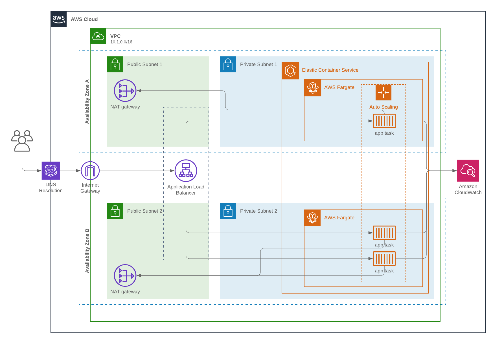

# example-aws-deployment

## Brief
Design a website for a modern company that has recently migrated their entire infrastructure to AWS. Demonstrate a basic website with some text and an image, hosted and managed using modern standards and practices in AWS. The proof of concept is to demonstrate hosting, managing, and scaling an enterprise-ready system.

## System design
### Overview


### Design choices
It was decided that the example app should be containerized and deployed to AWS using Elastic Container Service (ECS). As scaling was specified an important part of this exercise, and to speed up implementation AWS Fargate was used to provide compute resources. With AWS Fargate, you no longer have to provision, configure, or scale clusters of virtual machines to run containers. This removes the need to choose server types, decide when to scale your clusters, or optimize cluster packing.

### Network layout
The approach was taken to have a single region (single VPC), two availability zone (AZ) deployment. Each AZ contains a public and private subnet. As is usual for AWS deployments, workloads are executed in isolation in the private subnet, and access to resources is provided through the public (secured by security groups).

An Application Load Balancer (ALB) serves public traffic to endpoints (tasks/services), allowing for cross AZ deployments and scaling.

As deployed, the following network address spaces are provided (this is calculated by terraform so may change):

| Network        | CIDR           |
| ------------- |:-------------:|
| VPC      | 10.1.0.0/16 |
| Public A | 10.1.2.0/24 |
| Private A | 10.1.0.0/24  |
| Public B | 10.1.3.0/24  |
| Private B | 10.1.4.0/24  |

### Security
Access to the underlying ECS service (tasks) is controlled via a security group limiting ingress to that via the ALB only. Currently access to the ALB is global (via the gateway), however, there is the option to limit this.

Access to the infrastructure from a control plane perspective should be monitored and controlled using the usual best practices (least privilege, 2FA, etc).

### Availability and scaling
This example site has been set up to be Highly Available (HA). The ECS container instances are distributed between two availability zones to provide redundancy.

Horizontal scaling is provided via an autoscaling policy which will increase the instance count from 3 to 5 as load rises. More information at scaling can be found here: 

### Monitoring/Alerting
Monitoring is provided to ECS tasks via Cloudwatch. The tasks prescribing the container deployed in this example, specify the cloudwatch instance to log to. Cloudwatch is also used to monitor resource usage to provide autoscaling.

### Example app deployment
As an example app to run, a simple NGinx server is deployed, hosting a page with some basic JS and an image. The container `nginxdemos/hello:latest` is used for more information see: https://hub.docker.com/r/nginxdemos/hello/.

### Notable omissions
This implementation excludes the following elements for brevity:
- Separate non-prod environment - Dev/Tst/QA etc...
- Route 53 - Ingress traffic can use the ALB address but should use R53 in the future. This would also allow easer balancing between multiple regions.
- Caching - Where possible site content should be cached as close to the edge as possible.
- DDOS/Bot protection - Production endpoints should preferably be protected from malicious traffic.


## Deploying infrastructure
The infrastructure designed above is deployed using [Terraform](https://www.terraform.io). A modular approach to design has been taken. As this is a simple example deployment a mono-repo approach has been taken to modules.

The main Terraform definition for this deployment can be found in the folder `terraform/main`. This folder sets up the aws provider, some basic variables and then specifies the modules to be used.

### Authentication
[https://www.terraform.io/docs/providers/aws/index.html#authentication](https://www.terraform.io/docs/providers/aws/index.html#authentication) outlines the options for authenticating the Terraform AWS provider to AWS. To get started with this example from you local machine it is suggested that environmental variables are the best solution. 

### State
Terraform stores the current infrastructure state in a .tfstate file. As this is only an example storage in a local .tfstate file is the only supported method. Moving to production, state should be remote or managed in an alternative secure fashion.

### From local machine
Requirements: Terraform >= 0.12.0
```
$> cd terraform/main
$> terraform init
$> terraform apply
```

### Using Terraform Cloud
For production deployments or when collaborating with a wider team Terraform applies should only be carried out on a central continuous deployment server, with all changes first checked into Git (and reviewed). A service such as Terraform Cloud (or similar self-hosted Jenkins/TeamCity), should be used to automate deployments.


## Deploying application
### In this example
In this simple example the app which is running is defined as an ECS Fargate task in the terraform. A simple NGinx container is executed to provide a basic website. Deployment of the containers happens when deploying the infrastructure.

### In production
In production it is likely that the app would not be deployed at the same time as the infrastructure. App deployments would update the ECS task with references to new container versions. This would occur through a continuous deployment service, as with the infrastructure deployments all orchestrated through Git with proper oversight and automation.

Guides on how to manage ECS can be found in the [Amazon Elastic Container Service docs](https://docs.aws.amazon.com/en_pv/AmazonECS/latest/developerguide/Welcome.html).


## Modifying this project

### Adding additional AZ
Adding an additional AZ (in most places there are a maximum of 3 AZ) is simple. A parameter set of the network module allows setting of the AZ count. Terraform will then handle deploying infrastructure into the number of specified AZ

```
module "network"{
    source      = "../modules/network"

    aws_region  = var.aws_region
    az_count    = "2"
}
```

### Scaling
#### Horizontal scaling
Horizontal scaling is managed by an autoscaling policy which scales from 3 to 5 instances when the CPU usage is below 10% or above 75%.

```
resource "aws_appautoscaling_target" "target" {
  service_namespace  = "ecs"
  resource_id        = "service/${aws_ecs_cluster.main.name}/${aws_ecs_service.main.name}"
  scalable_dimension = "ecs:service:DesiredCount"
  role_arn           = aws_iam_role.ecs_auto_scale_role.arn
  min_capacity       = 3
  max_capacity       = 5
}

resource "aws_appautoscaling_policy" "up" {
  name               = "scale_up"
  service_namespace  = "ecs"
  resource_id        = "service/${aws_ecs_cluster.main.name}/${aws_ecs_service.main.name}"
  scalable_dimension = "ecs:service:DesiredCount"

  step_scaling_policy_configuration {
    adjustment_type         = "ChangeInCapacity"
    cooldown                = 60
    metric_aggregation_type = "Maximum"

    step_adjustment {
      metric_interval_lower_bound = 0
      scaling_adjustment          = 1
    }
  }

  depends_on = [aws_appautoscaling_target.target]
}

resource "aws_appautoscaling_policy" "down" {
  name               = "scale_down"
  service_namespace  = "ecs"
  resource_id        = "service/${aws_ecs_cluster.main.name}/${aws_ecs_service.main.name}"
  scalable_dimension = "ecs:service:DesiredCount"

  step_scaling_policy_configuration {
    adjustment_type         = "ChangeInCapacity"
    cooldown                = 60
    metric_aggregation_type = "Maximum"

    step_adjustment {
      metric_interval_lower_bound = 0
      scaling_adjustment          = -1
    }
  }

  depends_on = [aws_appautoscaling_target.target]
}
```

### Vertical scaling
Vertical scaling is not automated. It is possible to change the ECS task CPU/Memory request. By default 512 CPU units are prescribed (0.5 vCPU) and 1024MiB of memory. For Fargate only supported CPU/Memory combinations may be specified. For valid combinations see https://docs.aws.amazon.com/AmazonECS/latest/developerguide/task-cpu-memory-error.html.

```
resource "aws_ecs_task_definition" "app" {
  family                   = "app-task"
  execution_role_arn       = aws_iam_role.ecs_task_execution_role.arn
  network_mode             = "awsvpc"
  requires_compatibilities = ["FARGATE"]
  cpu                      = var.fargate_cpu
  memory                   = var.fargate_memory
  container_definitions    = data.template_file.app.rendered
}
```